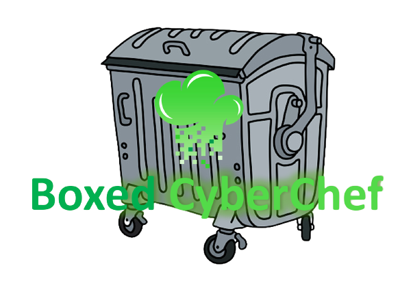

[](https://github.com/BenjiTrapp/boxed-cyberchef/actions/workflows/docker-publish.yml)
<p align="center">

</p>

[CyberChef](https://github.com/gchq/CyberChef) is an awesome product, that saves a lot of time during the daily analysis work. This repository focusses on a dockerized version of CyberChef to have your data not shared with GCHQ, but still the full power of CyberChef. The image will be build on a daily schedule to have the latest version of CyberChef baked in. 

A blog post, showing how to use CyberChef will soon follow on [benjitrapp.github.io](https://benjitrapp.github.io/)

## Prerequisites

You require:

* Docker installed > k8s helm chart might follow later
* Browser
* A tiny amount of hard disk space. The image is tried to build to be as small as possible

## How to start

Simply clone this repo and run:

```bash
make github
```
